# Image Classification using AWS SageMaker

Use AWS Sagemaker to train a pretrained model that can perform image classification by using the Sagemaker profiling, debugger, hyperparameter tuning and other good ML engineering practices. This can be done on either the provided dog breed classication data set or one of your choice.
I chose the dogbreed data set that has enough pictures(more than 8500 images).

## Project Set Up and Installation
Enter AWS through the gateway in the course and open SageMaker Studio. 
Download the starter files.
Download/Make the dataset available. 
This is the link to the Udacity Github repository:
https://github.com/udacity/CD0387-deep-learning-topics-within-computer-vision-nlp-project-starter

## Dataset
The provided dataset is the dogbreed classification dataset which can be found in the classroom. I downloaded it and observed that it has 3 subfolders "train", "test", "valid" and, each of subfolders contains 133 folders that indicates 133 breeds of dogs. The folder of every breed contains some 'jpg' images and the number of images in each breed may be varied. This is the Udacity link to the dataset:
https://s3-us-west-1.amazonaws.com/udacity-aind/dog-project/dogImages.zip

### Access
I uploaded the data to an S3 bucket through the AWS Gateway so that SageMaker has access to the data. Before this you must attach approporiate s3 pollicy to your sagemaker execution role in the IAM section of the AWS. 

## About .py files
There are four .py files in this repository:

- hpo.py
> In the hpo.py file, there is the code for hyperparameter tuning a pretrained (Resnet50) model. It resizes the images of the given dataset (dogImages) to 224 by 224 images, and then train the images and at last takes a test from the test folder of the dataset to obtain the "Testing Loss". Finally the hyperparameters (batch_size, learning_rate) of the training job having the least Testing Loss, is chosen as the best hyperparameters for training the model.

- train_model.py
> In this file we train the model on our best hypereparameters achieved from the hyperparameter tuning. We also have added some hooks to get information of the training procedure by Sagemaker debugger and profiler. Using these information we can observe if the model is overfitting or underfitting or, if the gradient is converging to a optimum or not or, if we are using the cpu/gpu in a optimal way and etc.

- inference.py
>In this file, we are proposing the way we want to give the input to our model to get the inference as an output. WE need this file as an entry point for creating an endpoint of our model that can easily use our model to predict the class of any given image afterwards.

- lambda_function.py
> Using this file we create a lambda function to invoke our endpoint when we call it. We should give Sagemaker access policy to our lambda function to allow it to work.

There are 3 zip folders containing images from every 3 steps of "hyperparameter tuning", "profiling" and "deploy" of the model on this repository. The hyperparameters used for the second step (profiling) may vary with the best parameters of the first step, because of several times tuning the model.

## Hyperparameter Tuning
I used Resnet50 pretrained model that has a suitable size of download while has enough layers for prediction. It's easy to use through torchvision models Python package and is one the good models for image classification jos.I gave a continuous parameter of "learning rates" between 0.001 and 0.3, and a categorical parameter "batch size" of amounts 16, 32, 64  to a Pytorch estimator object. these ranges used for the hyperparameter searching and fine tuning the Resnet50 model with the dogBreed dataset. 

You can see:

- Tune at least two hyperparameters:

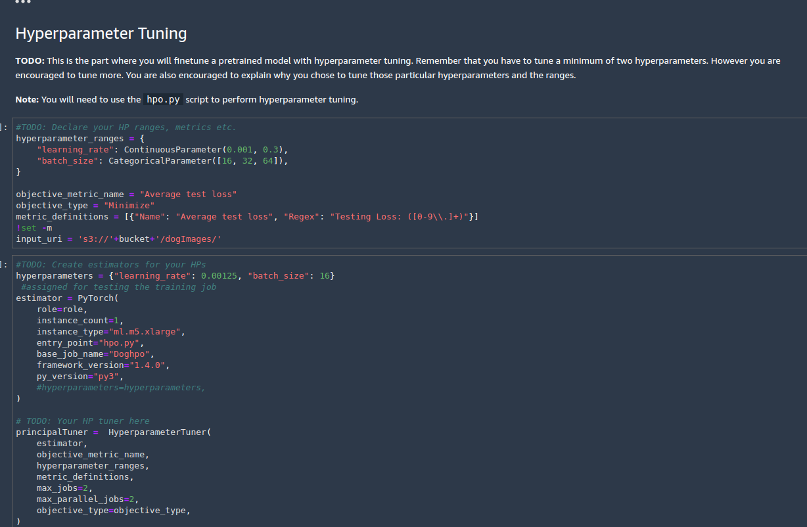

- A screenshot of my HPO job that shows at least 2 different training runs and their results:

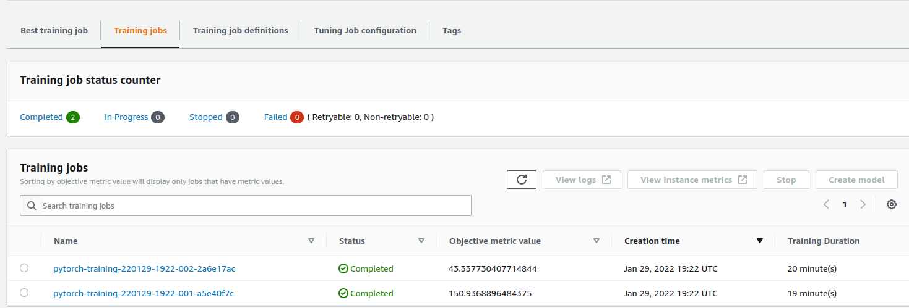

- Retrieve the best best hyperparameters from all your training jobs:

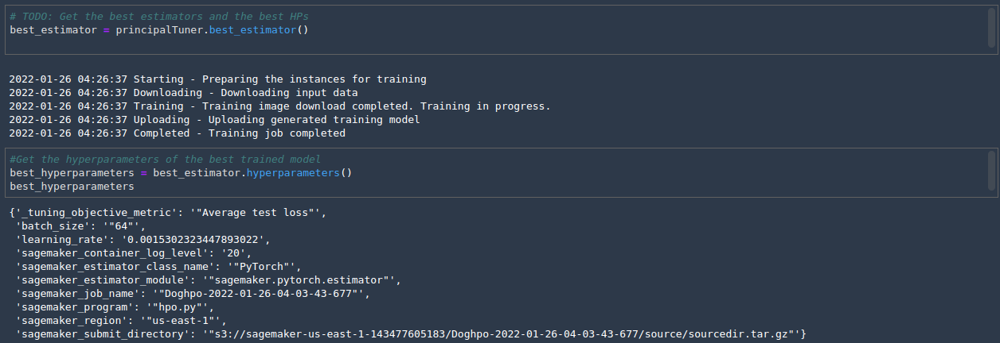

- A line plot showing "Testing Loss"’s status throughout the HPO tuning process:

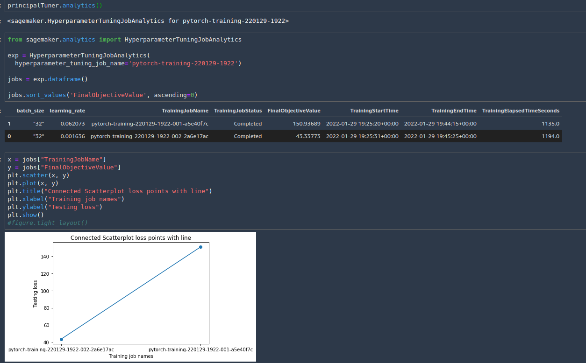

## Debugging and Profiling

I added hooks to my hyperparameter tuning file "hpo.py" and stored it in "model_train.py". I also wrote some profiler and debugger rules in my main program before calling the .py file as an entry to an estimator. We know that these 2 packages help us to better monitor the procedure of training our model. For example if we have added the hooks on our loss function in our training file, then by supervising all of the training or validating losses we can understand that our model is training well or not e.g. if there is not a decreasing procedure on our trainig loss we understand that the learning rate is big and should use a lower amount of learning rate for fitting the model. Also, profiling will give us some useful information of our fitting bottlenecks and helps us to choose number of suitable gpus.

- A screenshot of completed training jobs:

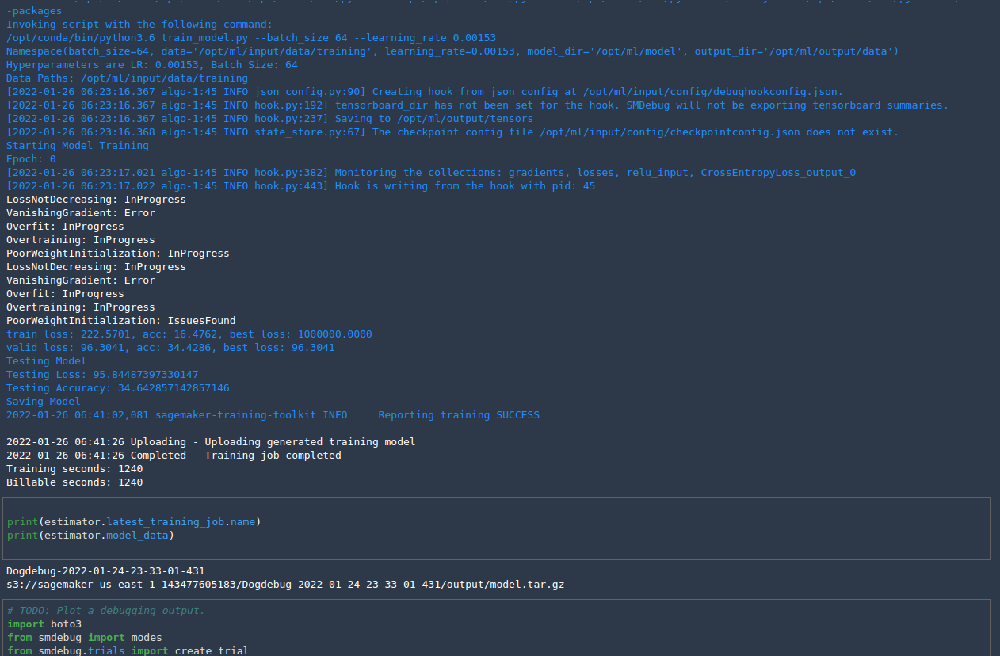

- Logs metrics during the training process:

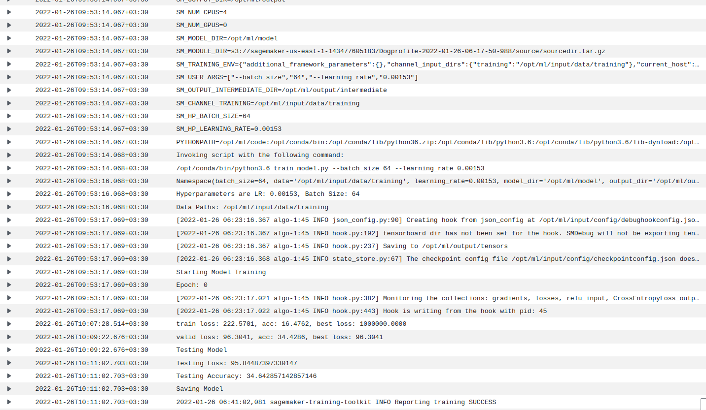

- A line plot showing the Cross Antropy loss status throughout the training process:

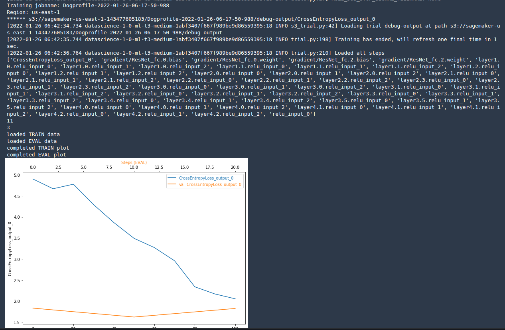

- Profiler CPU utilization report:

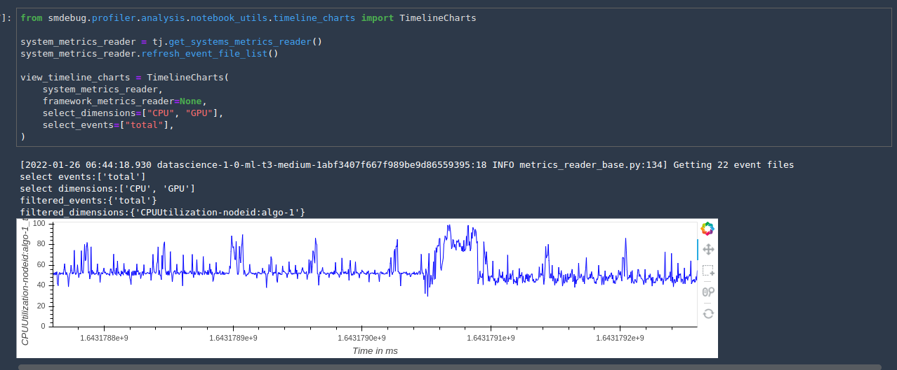

### Results
What are the results/insights did you get by profiling/debugging your model?
My model is fitting with a low speed. I should use an instance that has gpu access for calling my Pytorch estimator. Also I can consider different kinds of transformation on my dataset images before using the estimator. If my loss plot shows some obnormality in decreasing the loss of train/validation dataset, I can consider changing in my hyperparameters to train the model again in a better way.

The profiler html/pdf file in your submission.

## Model Deployment

The sagemaker has this great option that you can save the endpoint of a trained model to make predictions easily in the near future. It can easily be done by using the deploy function. After that and for making predictions from your endpoint you need to define a serializer that can feed the type of inputs (here the jpg/png images) to your saved model and return the predictions. You may use inference.py file as an entry point to a PyTorchModel to create a Pytorch model. In the inference.py file you should write the codes that explaint what should the model do with an input data. Note that the input data may be an image or a url to an image. After deploying the model with an instance type and creating the endpoint, you should create a lambda function invoke your endpoint when need a prediction. So I created a lambda function that communicate with the endpoint and pass the result of predictions. Don't forget to give desired pollicies to your lambda function e.g. Amazon Sagemaker Access. After using endpoints and making predictions from them, don't forget to delete them or you may incur a lot of costs.

- Build an endpoint:

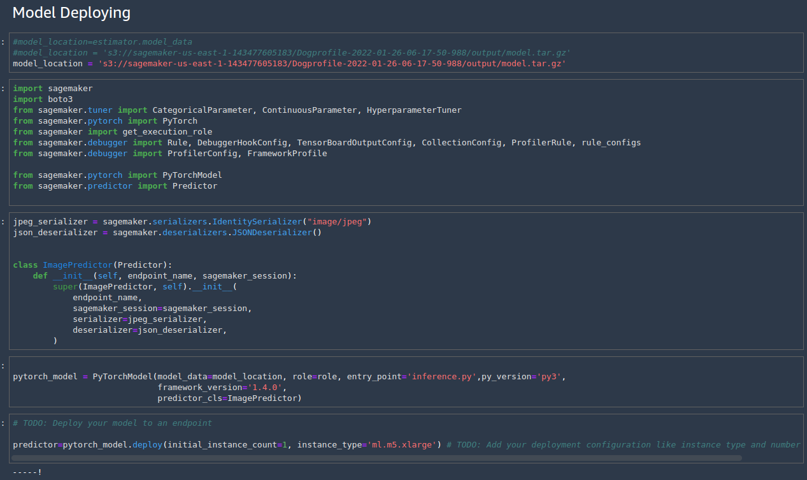

A screenshot of the deployed active endpoint in Sagemaker.

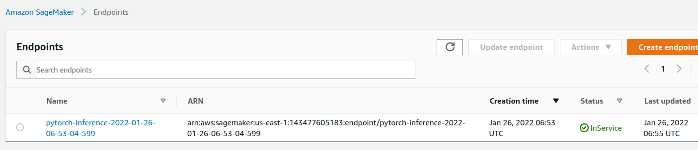

- Getting a local saved image:

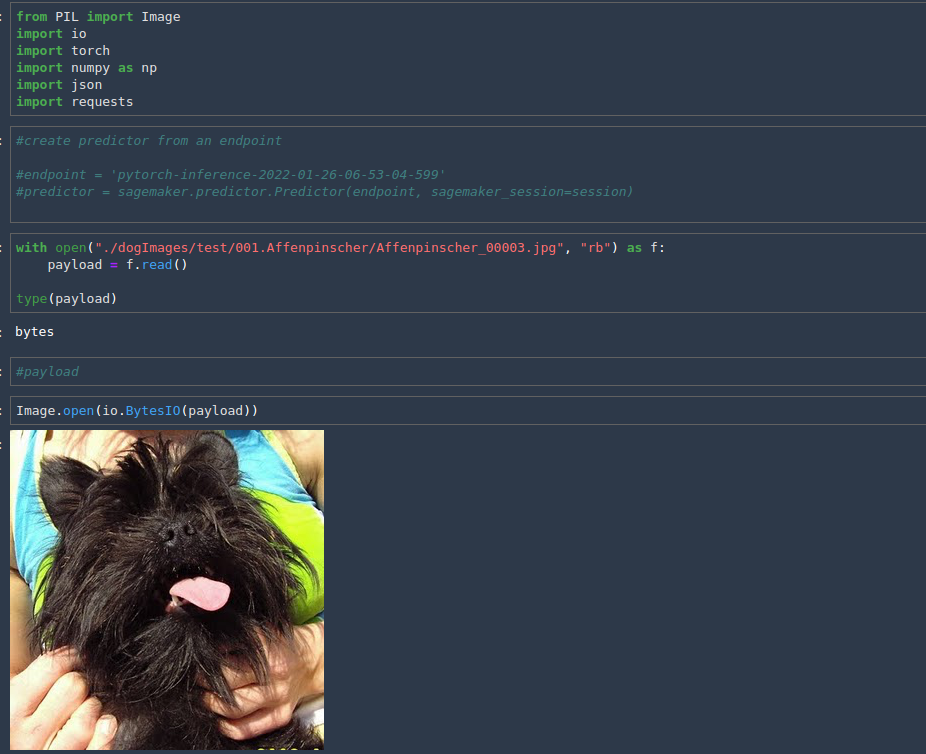

- Quering the model endpoint for raw and classified response:

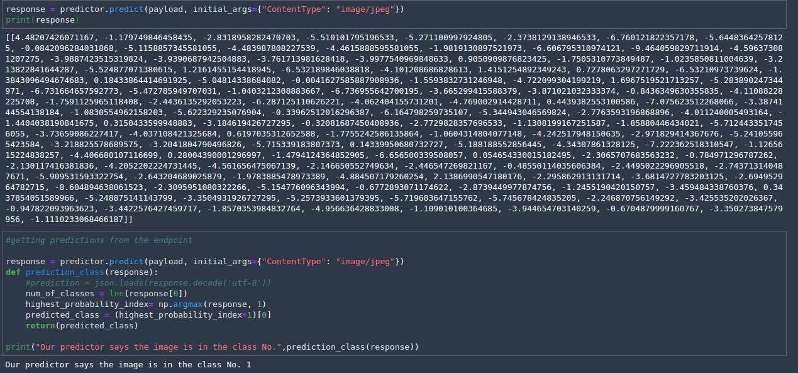

##Attention 

**You can also see many other screenshots from different steps of all the stages of the program in 3 folders "hpo-training-images", "profiling", and "deploy" that exist in this repository.**

## Standout Suggestions

I can consider many changes in my hyperparameters to get a model that can be fitted to our dataset at a higher speed and accuracy. This could be a good idea to try different kinds of pretrained models, and transformations and batching numbers on the dataset and conclude what changes can best improve the model accuracy.

